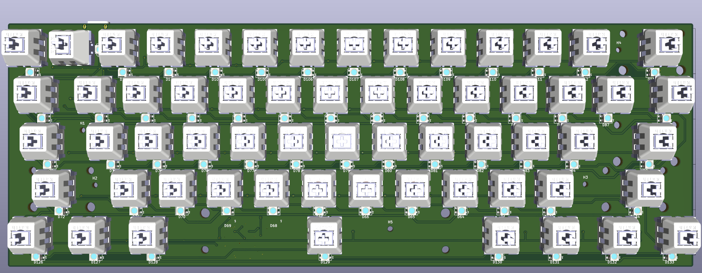
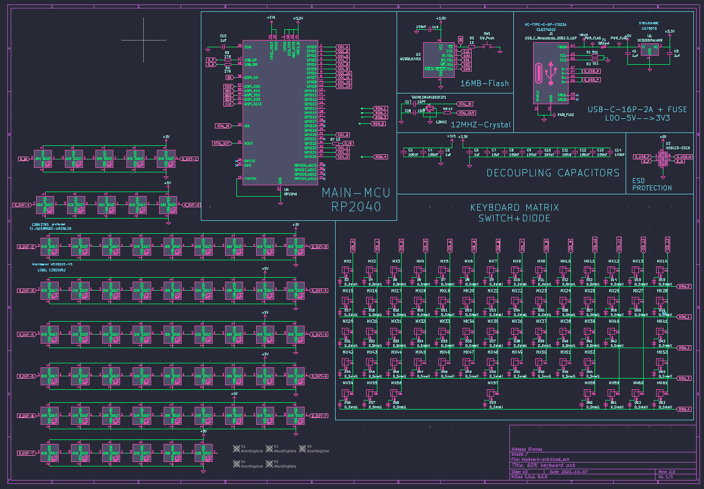

# ⌨️ RP2040 60% Keyboard PCB

My first custom mechanical keyboard PCB design, built with RP2040, hot-swap sockets, and a full matrix.

---

## ⚠️ Important Disclaimer

> 🚧 **This PCB has NOT been physically tested yet.**
> It has only been designed and verified in KiCad (DRC + ERC), but:
> * No real-world prototype has been assembled
> * There may be design mistakes
> * Use at your own risk if you decide to manufacture it

👉 *This project is shared for learning, experimentation, and community feedback.*

---

## 📸 Preview




---

## 📌 Project Overview

This is a 60% mechanical keyboard PCB designed as a learning project.

I’m a systems & network specialist, and this is my first experience with:
* PCB design
* Electronics
* Hardware prototyping

Instead of starting small, I challenged myself with a full keyboard to learn faster.

---

## ⚙️ Features

* 🧠 **RP2040 MCU**
* 🔌 **USB-C connectivity**
* ⌨️ **60% layout**
* 🔁 **Kailh hot-swap sockets**
* 🔲 **Cherry MX compatible**
* 🔌 **Matrix scanning** (row/column)
* ➕ **Per-key diodes**
* 💡 **LED support** 
* 📦 **2-layer PCB** (JLCPCB / PCBWay ready)

---

## 📂 Repository Structure

```text
├── hardware
│   ├── kicad              → KiCad project files
│   ├── gerbers            → Ready-to-manufacture files
│   ├── drills             → NC drill files for manufacturing
│   ├── bom.txt            → Components list
│
└── images                 → Renders, schematic
├── README.md
└── LICENSE
```
---

## 🧩 How the Keyboard Works

### 🗺️ Matrix Design
The keyboard uses a row/column matrix:
* **Each key** = switch + diode
* **Rows** → outputs
* **Columns** → inputs (or vice versa)

👉 *This reduces GPIO usage on the RP2040.*

### 🔄 Example Flow
1. MCU activates a row.
2. Reads all columns.
3. Detects which switch is pressed.
4. Moves to the next row.

### ➕ Why Diodes?
Each switch includes a diode to prevent:
* ❌ Ghosting
* ❌ Key conflicts

---

## 🔌 USB & Power

* USB-C connector.
* 5V input → regulated to 3.3V.
* ESD protection included (basic).
* Decoupling capacitors placed near the MCU.


---

## 💡 LEDs

* Basic per-key LED footprint included.
* advanced RGB controller.
* firmware implementation.

---

## 🛠️ How to Manufacture

### 1. Export Gerbers
Already included in `hardware/gerbers`.

### 2. Order PCB
You can use manufacturers like:
* [JLCPCB](https://jlcpcb.com)
* [PCBWay](https://www.pcbway.com)

**Recommended settings:**
* **Layers:** 2
* **Thickness:** 1.6mm
* **Copper:** 1oz
* **Finish:** HASL or ENIG

### 3. Order Components
Use the BOM list located in `/hardware/bom.csv`.

**Main parts needed:**
* RP2040 MCU
* USB-C connector
* Diodes (SMD)
* Resistors & capacitors
* Kailh hot-swap sockets

### 4. Assembly Steps
1. Solder MCU + passive components.
2. Solder USB section.
3. Add diodes.
4. Install hot-swap sockets.
5. Plug in the switches.

---

## 💻 Firmware

Planned support:
* **QMK**
* **KMK** (CircuitPython, extremely RP2040 friendly)

---

## 🧱 Mounting Style

* PCB includes mounting holes.
* Designed to be compatible with **tray mount** cases (most likely).

**🧠 Future considerations:**
* Gasket mount support
* Plate integration
* Case compatibility

---

## 🔄 V2 (In Progress)

Planned improvements for the next revision:
* ✅ Design fixes after the first physical prototype
* 🔌 Improved USB + power circuit
* 💡 Better LED implementation (possibly addressable RGB)
* 📐 Cleaner routing
* 🧱 Case compatibility improvements
* 💻 **Full QMK / VIAL Firmware Support**
  * 🌈 Hardware-level RGB matrix controller integration (e.g., IS31FL3731 or similar)
  * 🎹 Dedicated onboard EEPROM / Flash partitioning for custom on-the-fly macros
  * ⚙️ VIAL compatibility for GUI-based key remap and macro configuration

---

## 🧊 Keyboard Case (Fusion 360)

🛠️ A custom keyboard case is currently being designed in Fusion 360.

👉 *Not ready yet — stay tuned!*

---

## 🤝 Contributing

Feedback is highly appreciated! 🙌

If you notice:
* Design mistakes
* Better routing ideas
* Power improvements
* General suggestions

👉 *Please open an issue or submit a Pull Request!*

---

## 📖 Learning Resources

This project was inspired by:
* Official RP2040 Hardware Design Guides * [Hardware design with RP2040](https://pip-assets.raspberrypi.com/categories/814-rp2040/documents/RP-008279-DS-1-hardware-design-with-rp2040.pdf)
* Open-source keyboard PCBs * [Keyboard PCB Guide](https://github.com/ruiqimao/keyboard-pcb-guide)
* Community design projects

---

## 📜 License

This project is licensed under the [CC0-1.0 license](LICENSE).

---

## 🙌 Final Note

Thank you so much for taking the time to check out my very first PCB project! As a systems & network student, diving into the world of hardware design and electronics has been an incredibly exciting challenge. Having you read through this repository means a lot to me.

This is my first PCB ever, so expect some imperfections! 
The ultimate goal is to **learn, share, and improve publicly**. If this helps you or you decide to build it, that’s already a win!

### ⭐ Support
If you like this project:
* ⭐ **Star** this repo
* 🍴 **Fork** it to play with it
* 📧 **Reach out** — Let's connect on [Discord](https://discord.com/users/661954505289760768) or [LinkedIn](https://www.linkedin.com/in/zaki-mohamed-48a702226)!
* 💬 **Open an Issue or PR** — I'd love your feedback!
